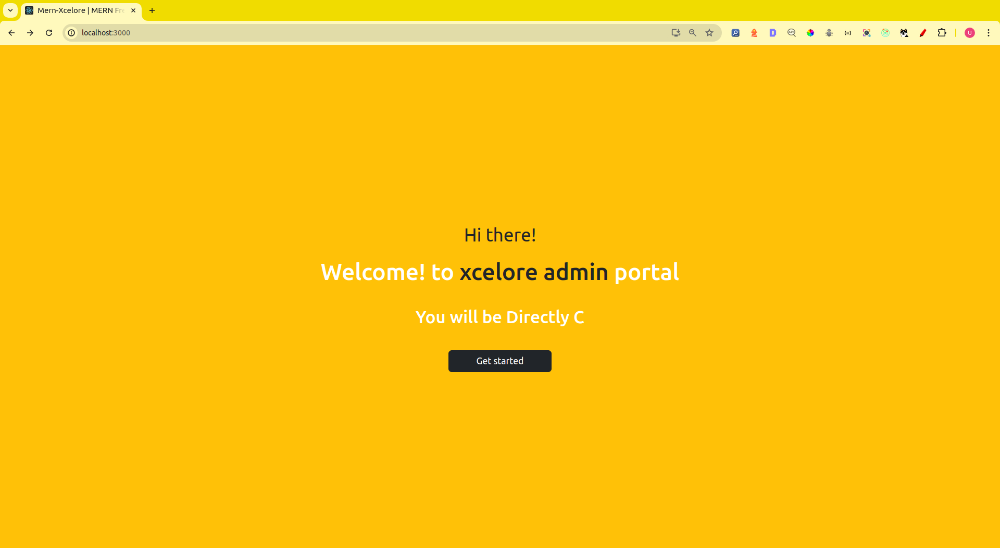
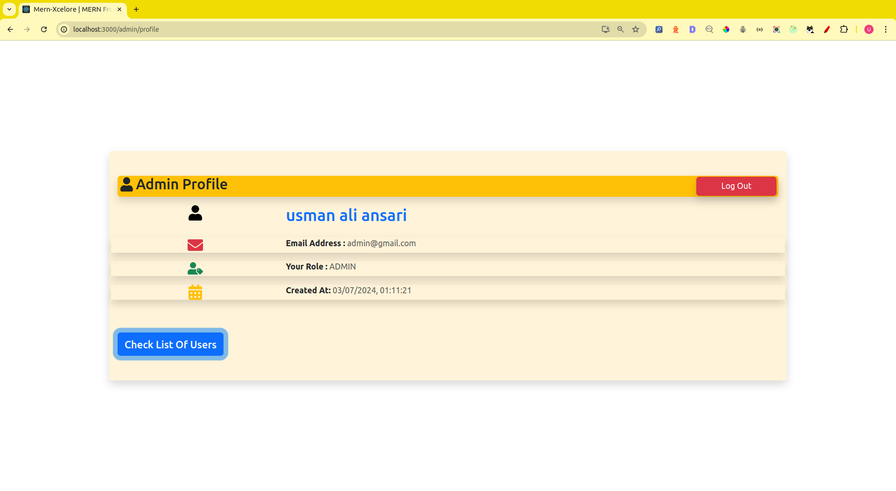
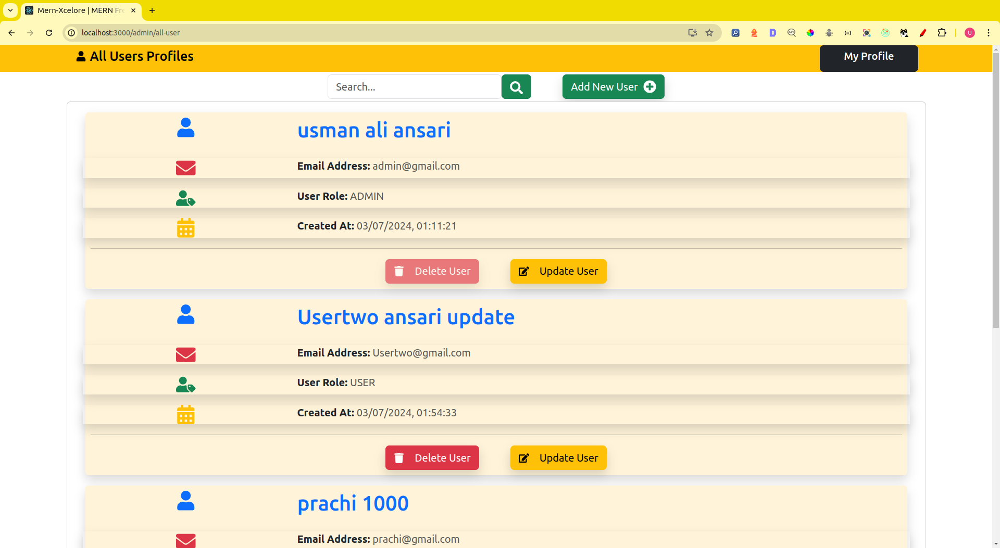
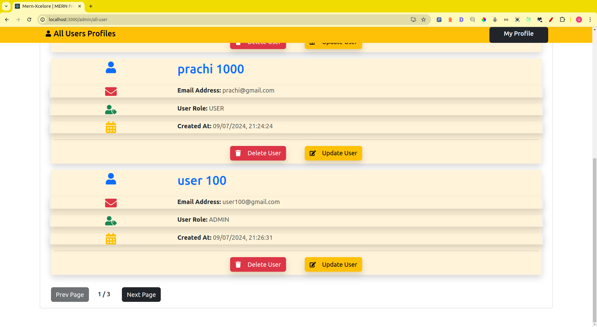
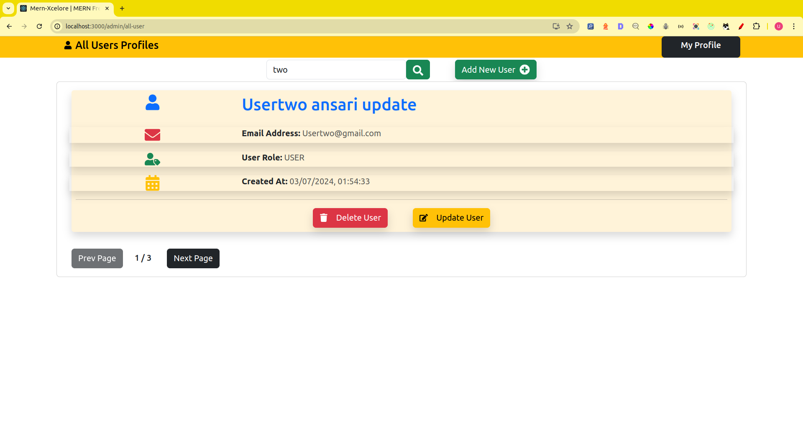
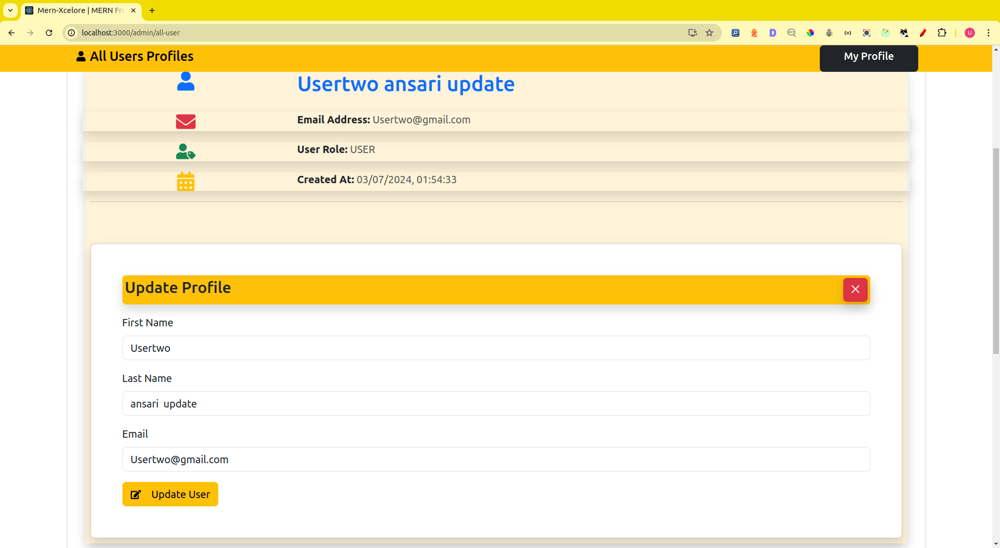
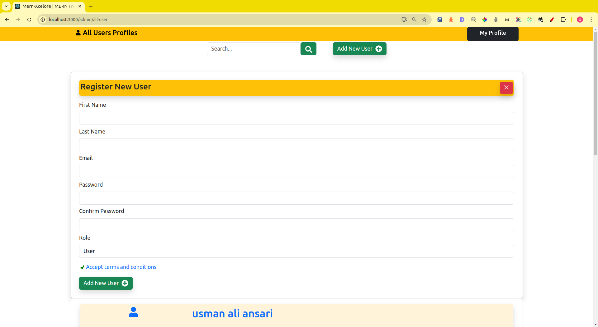
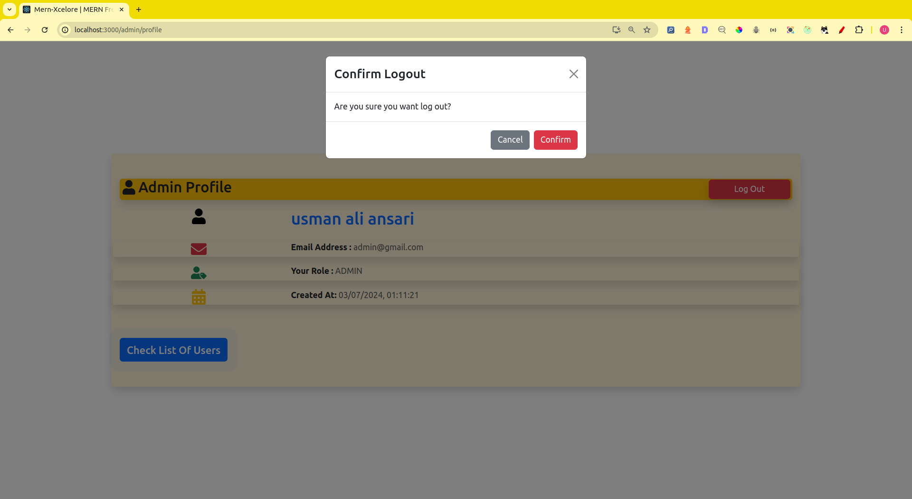
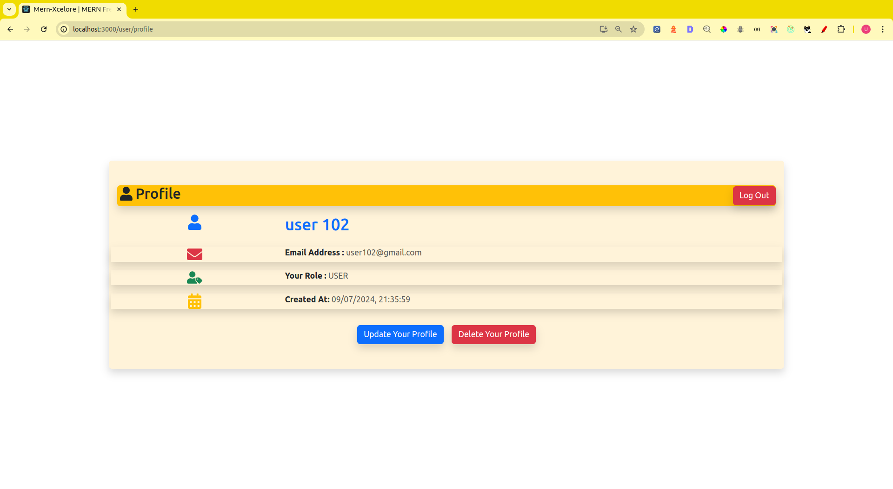

## Application SetUp

- Environment Vairable set start your MongoDB server
### DEVELOPMENT MODE

- rename file example.development.env to .env or use following command
- install node package
- start server in development mode

```
cp example.development.env .env
npm install
npm run dev

```

- open new terminal follow these command respectively

```
cd frontend
cp example.development.env .env
npm install
npm start
```


### PRODUCTION MODE
### Update your .env file Credentials

- rename file example.production.env to .env or use following command
- install node package
- start server in development mode

```
cp example.production.env .env
npm install
npm run start

```

- open new terminal follow these command respectively

```
cd frontend
cp example.production.env .env
npm install
npm run build
npm start
```


# Deployed Link
- ```Frontend``` : https://mern-xcelore.netlify.app
- ```Backend``` :  https://backend-mern-xcelore.vercel.app

# Frontend :
## Getting Started with Create React App
- CREATE, SEARCH, DELETE, UPDATE --ADMIN/USER










# Backend:
### User Authentication:
- Register: A new user should be able to register with a first name, last name,
email, and password.
- Login: A registered user should be able to log in using their email and password.
- Logout: A logged-in user should be able to log out.

### Admin Panel:
- Create: Admin should be able to add new users.
- Read: Admin should be able to view the list of users.
- Update: Admin should be able to edit user details.
- Delete: Admin should be able to delete users

### Additional Requirements (Difficulty Enhancement):
- Password Encryption: Ensure that user passwords are securely hashed and
stored in the database.
-  Role-based Access Control (RBAC): Implemented roles (e.g., Admin, User) and
ensure only admins can access the admin panel.
- Form Validation: Implemented  ```[backend]``` form validation for registration
and login forms.
- Error Handling: Implemented proper error handling ```[backend]```
- Pagination and Search: Added pagination from ```[.ENV]``` and search from ```[query params]``` functionality to the user list in
the admin panel.

# BACKEND POSTMAN collection API:


# Project: Admin


## End-point: for the first time Admin Registration
### Method: POST
>```
>http://localhost:5000/api/v1/admin/first-time-admin-hidden/register
>```
### Body (**raw**)

```json
{
"first_name":"usman",
"last_name":"ansari",
"email":"admin@gmail.com",
"password":"admin!@#123",
"role":"admin"
}
```


⁃ ⁃ ⁃ ⁃ ⁃ ⁃ ⁃ ⁃ ⁃ ⁃ ⁃ ⁃ ⁃ ⁃ ⁃ ⁃ ⁃ ⁃ ⁃ ⁃ ⁃ ⁃ ⁃ ⁃ ⁃ ⁃ ⁃ ⁃ ⁃ ⁃ ⁃ ⁃ ⁃ ⁃ ⁃ ⁃ ⁃ ⁃ ⁃ ⁃ ⁃ ⁃ ⁃ ⁃ ⁃ ⁃ ⁃

## End-point: Add a User -> ADMIN Auth
### Method: POST
>```
>http://localhost:5000/api/v1/admin/register
>```
### Body (**raw**)

```json
{
"first_name":"usman",
"last_name":"ansari",
"email":"admin@gmail.com",
"password":"admin!@#123",
"role":"admin"
}
```

⁃ ⁃ ⁃ ⁃ ⁃ ⁃ ⁃ ⁃ ⁃ ⁃ ⁃ ⁃ ⁃ ⁃ ⁃ ⁃ ⁃ ⁃ ⁃ ⁃ ⁃ ⁃ ⁃ ⁃ ⁃ ⁃ ⁃ ⁃ ⁃ ⁃ ⁃ ⁃ ⁃ ⁃ ⁃ ⁃ ⁃ ⁃ ⁃ ⁃ ⁃ ⁃ ⁃ ⁃ ⁃ ⁃ ⁃

## End-point: All users -> ADMIN Auth
### Method: GET
>```
>http://localhost:5000/api/v1/admin/users
>```
### Body (**raw**)

```json

```


⁃ ⁃ ⁃ ⁃ ⁃ ⁃ ⁃ ⁃ ⁃ ⁃ ⁃ ⁃ ⁃ ⁃ ⁃ ⁃ ⁃ ⁃ ⁃ ⁃ ⁃ ⁃ ⁃ ⁃ ⁃ ⁃ ⁃ ⁃ ⁃ ⁃ ⁃ ⁃ ⁃ ⁃ ⁃ ⁃ ⁃ ⁃ ⁃ ⁃ ⁃ ⁃ ⁃ ⁃ ⁃ ⁃ ⁃

## End-point: Single-> Admin Auth
### Method: GET
>```
>http://localhost:5000/api/v1/admin/user/66845859f139f221701037ab
>```
### Body (**raw**)

```json

```


⁃ ⁃ ⁃ ⁃ ⁃ ⁃ ⁃ ⁃ ⁃ ⁃ ⁃ ⁃ ⁃ ⁃ ⁃ ⁃ ⁃ ⁃ ⁃ ⁃ ⁃ ⁃ ⁃ ⁃ ⁃ ⁃ ⁃ ⁃ ⁃ ⁃ ⁃ ⁃ ⁃ ⁃ ⁃ ⁃ ⁃ ⁃ ⁃ ⁃ ⁃ ⁃ ⁃ ⁃ ⁃ ⁃ ⁃

## End-point: Update ->ADMIN Auth
### Method: PUT
>```
>http://localhost:5000/api/v1/admin/user/66845859f139f221701037ab
>```
### Body (**raw**)

```json
{
    "first_name": "name updated by admin"
}
```


⁃ ⁃ ⁃ ⁃ ⁃ ⁃ ⁃ ⁃ ⁃ ⁃ ⁃ ⁃ ⁃ ⁃ ⁃ ⁃ ⁃ ⁃ ⁃ ⁃ ⁃ ⁃ ⁃ ⁃ ⁃ ⁃ ⁃ ⁃ ⁃ ⁃ ⁃ ⁃ ⁃ ⁃ ⁃ ⁃ ⁃ ⁃ ⁃ ⁃ ⁃ ⁃ ⁃ ⁃ ⁃ ⁃ ⁃

## End-point: Delete -> ADMIN Auth
### Method: DELETE
>```
>http://localhost:5000/api/v1/admin/user/66845859f139f221701037ab
>```
### Body (**raw**)

```json
{
    "first_name": "name update by admin"
}
```


⁃ ⁃ ⁃ ⁃ ⁃ ⁃ ⁃ ⁃ ⁃ ⁃ ⁃ ⁃ ⁃ ⁃ ⁃ ⁃ ⁃ ⁃ ⁃ ⁃ ⁃ ⁃ ⁃ ⁃ ⁃ ⁃ ⁃ ⁃ ⁃ ⁃ ⁃ ⁃ ⁃ ⁃ ⁃ ⁃ ⁃ ⁃ ⁃ ⁃ ⁃ ⁃ ⁃ ⁃ ⁃ ⁃ ⁃

# Project: User

## End-point: Register -> USER
### Method: POST
>```
>http://localhost:5000/api/v1/user/register
>```
### Body (**raw**)

```json
{
"first_name":"demo",
"last_name":"user",
"email":"demouser@gmail.com",
"password":"demouser"
}
```


⁃ ⁃ ⁃ ⁃ ⁃ ⁃ ⁃ ⁃ ⁃ ⁃ ⁃ ⁃ ⁃ ⁃ ⁃ ⁃ ⁃ ⁃ ⁃ ⁃ ⁃ ⁃ ⁃ ⁃ ⁃ ⁃ ⁃ ⁃ ⁃ ⁃ ⁃ ⁃ ⁃ ⁃ ⁃ ⁃ ⁃ ⁃ ⁃ ⁃ ⁃ ⁃ ⁃ ⁃ ⁃ ⁃ ⁃

## End-point: Login -> USER/ADMIN
### Method: POST
>```
>http://localhost:5000/api/v1/user/login
>```
### Body (**raw**)

```json
{
    "email":"demouser@gmail.com",
    "password":"demouser"
}
```


⁃ ⁃ ⁃ ⁃ ⁃ ⁃ ⁃ ⁃ ⁃ ⁃ ⁃ ⁃ ⁃ ⁃ ⁃ ⁃ ⁃ ⁃ ⁃ ⁃ ⁃ ⁃ ⁃ ⁃ ⁃ ⁃ ⁃ ⁃ ⁃ ⁃ ⁃ ⁃ ⁃ ⁃ ⁃ ⁃ ⁃ ⁃ ⁃ ⁃ ⁃ ⁃ ⁃ ⁃ ⁃ ⁃ ⁃

## End-point: Logout -> USER auth required
### Method: POST
>```
>http://localhost:5000/api/v1/user/logout
>```
### Body (**raw**)

```json

```


⁃ ⁃ ⁃ ⁃ ⁃ ⁃ ⁃ ⁃ ⁃ ⁃ ⁃ ⁃ ⁃ ⁃ ⁃ ⁃ ⁃ ⁃ ⁃ ⁃ ⁃ ⁃ ⁃ ⁃ ⁃ ⁃ ⁃ ⁃ ⁃ ⁃ ⁃ ⁃ ⁃ ⁃ ⁃ ⁃ ⁃ ⁃ ⁃ ⁃ ⁃ ⁃ ⁃ ⁃ ⁃ ⁃ ⁃

## End-point: Profile -> USER auth required
### Method: GET
>```
>http://localhost:5000/api/v1/user/me
>```
### Body (**raw**)

```json

```


⁃ ⁃ ⁃ ⁃ ⁃ ⁃ ⁃ ⁃ ⁃ ⁃ ⁃ ⁃ ⁃ ⁃ ⁃ ⁃ ⁃ ⁃ ⁃ ⁃ ⁃ ⁃ ⁃ ⁃ ⁃ ⁃ ⁃ ⁃ ⁃ ⁃ ⁃ ⁃ ⁃ ⁃ ⁃ ⁃ ⁃ ⁃ ⁃ ⁃ ⁃ ⁃ ⁃ ⁃ ⁃ ⁃ ⁃

## End-point: Update -> USER auth required
### Method: PUT
>```
>http://localhost:5000/api/v1/user/me
>```
### Body (**raw**)

```json
{
    "first_name":"update name"
}
```


⁃ ⁃ ⁃ ⁃ ⁃ ⁃ ⁃ ⁃ ⁃ ⁃ ⁃ ⁃ ⁃ ⁃ ⁃ ⁃ ⁃ ⁃ ⁃ ⁃ ⁃ ⁃ ⁃ ⁃ ⁃ ⁃ ⁃ ⁃ ⁃ ⁃ ⁃ ⁃ ⁃ ⁃ ⁃ ⁃ ⁃ ⁃ ⁃ ⁃ ⁃ ⁃ ⁃ ⁃ ⁃ ⁃ ⁃

## End-point: Delete -> USER auth required
### Method: DELETE
>```
>http://localhost:5000/api/v1/user/me
>```
### Body (**raw**)

```json
{
    "first_name":"update name"
}
```


⁃ ⁃ ⁃ ⁃ ⁃ ⁃ ⁃ ⁃ ⁃ ⁃ ⁃ ⁃ ⁃ ⁃ ⁃ ⁃ ⁃ ⁃ ⁃ ⁃ ⁃ ⁃ ⁃ ⁃ ⁃ ⁃ ⁃ ⁃ ⁃ ⁃ ⁃ ⁃ ⁃ ⁃ ⁃ ⁃ ⁃ ⁃ ⁃ ⁃ ⁃ ⁃ ⁃ ⁃ ⁃ ⁃ ⁃
_________________________________________________
